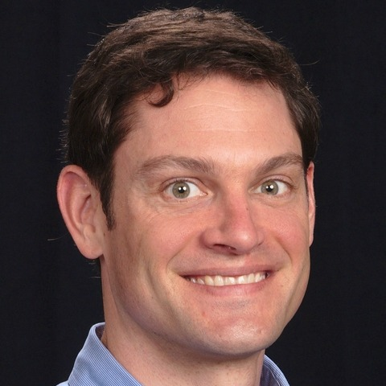
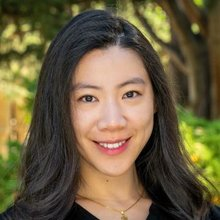
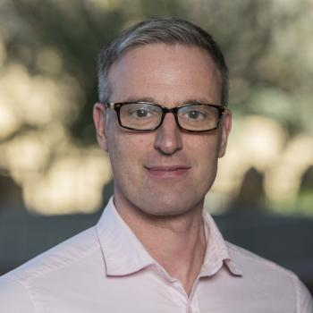
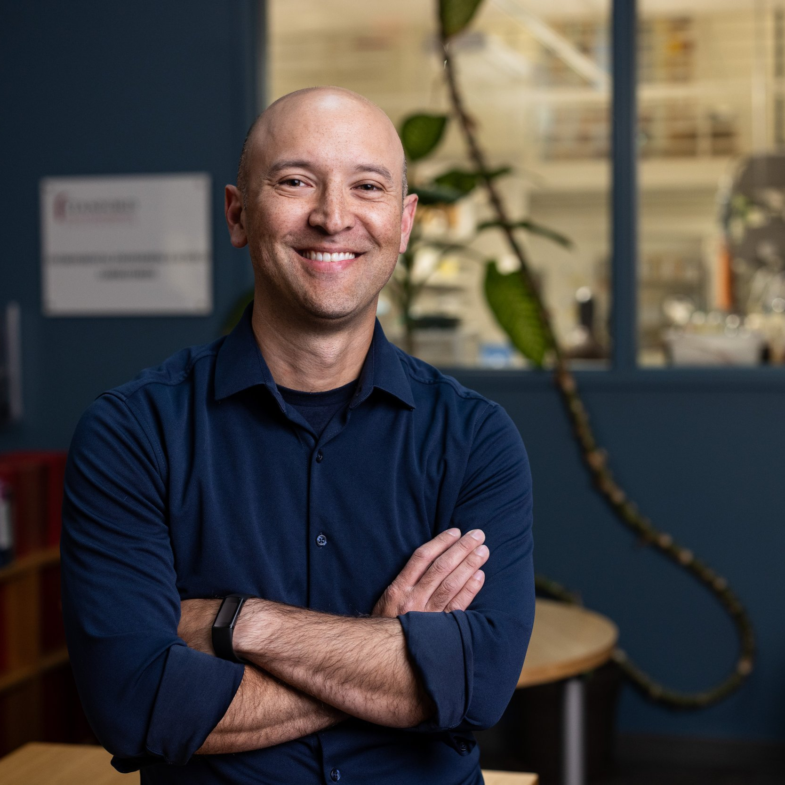
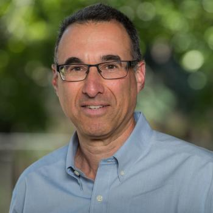
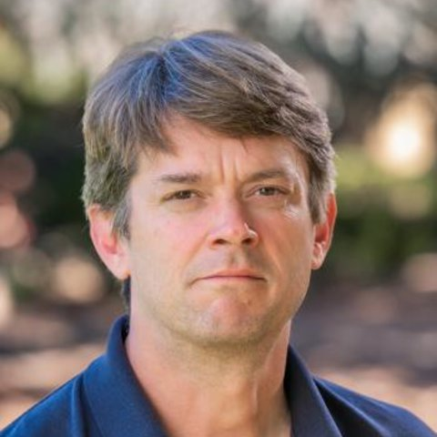
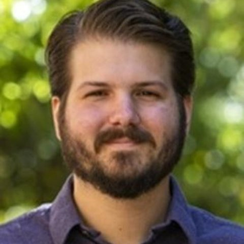
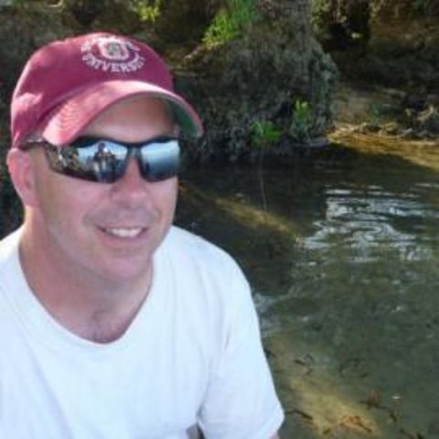

# About SDSS-CC

The Stanford Doerr School of Sustainability Center for Computation advances research and scholarship by providing the SDSS community with high-end computing, data storage, and technical support. We work with Stanford Research Computing to make research infrastructure accessible, effective, and responsive to community needs.

## Leadership and governance

SDSS-CC is guided by faculty directors and faculty representatives from across the school. This governance group connects research communities with SDSS-CC leadership, helps identify resource gaps, and informs future investments.

::::{grid} 1 2 3 3

:::{grid-item-card} Eric Dunham

**Director** 
Geophysics
:::

:::{grid-item-card} Yao Lai

**Governance Representative** 
Geophysics
:::

:::{grid-item-card} Jef Caers

**Governance Representative** 
Geological Sciences
:::

:::{grid-item-card} Sol Hsiang

**Governance Representative** 
Earth System Science
:::

:::{grid-item-card} Lou Durlofsky

**Governance Representative** 
Energy Science and Engineering
:::

:::{grid-item-card} Oliver Fringer

**Governance Representative** 
Civil and Environmental Engineering (CEE), Oceans
:::

::::

The directors and governance representatives serve as liaisons between research groups in their departments and SDSS-CC leadership.

## Staff

::::{grid} 1 2 3 3

:::{grid-item-card} Mark Yoder

**Research Software Engineer and Computational Scientist**
:::

:::{grid-item-card} Brian Chivers

**Research Software Engineer**
:::

:::{grid-item-card} Brian Tempero

**HPC System Administrator and Specialist**
:::

::::
