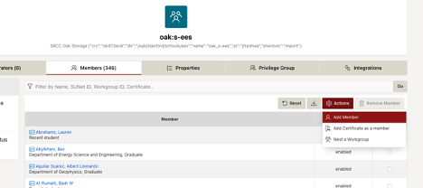

# Getting Started: Oak

## What is *oak*?
In a word, *oak* is storage. Lots of it. *Oak* is a LUSTRE filesystem -- designed principally to be used with *Sherlock*, but accessible from other platforms as well. Ask your PI if they have a group space on *oak*! If not, your group might be eligible for an SDSS provided Oak space, and you may also be eligible to use the SDSS-CC shared Oak space. 

If you require Oak storege, or need to increase your storage allocation, please [contact the SDSS-
CC management team](/get-in-touch) to discuss options. 

## Connecting to *oak*:
### Sherlock:
The *oak* filesystem is automatically mounted for *Sherlock* sessions. Group spaces can be found at:
- `/oak/stanford/groups/${pi_sunet}`

The SDSS shared space is:
- `/oak/stanford/schools/ees/${pi_group}`

For convenience, a symbolic link can be made -- for example, in your `$HOME` directory, like

```
$ ln -s /oak/stanford/schools/ees/${pi_group} ~/oak_sdss
```

### Connecting your laptop (and other systems too):
This can be mounted on your local system (or a remote HPC) via an Oak data transfer node (DTN), for example ([see also](general-requirements#sherlock) ) :

```
sshfs sunetid@oak-dtn.stanford.edu:/oak/stanford/schools/ees/${pi_SUNetID} ~/${my_ees_mount_point} -o cache=no -o nolocalcaches -o volname=oak-sshfs -o defer_permissions
```

Similarly, for private Oak spaces:

```
sshfs sunetid@oak-dtn.stanford.edu:/oak/stanford/groups/${pi_SUNetID} ~/${my_group_mount_point} -o cache=no -o nolocalcaches -o volname=oak-sshfs -o defer_permissions
```

For more information about connecting to or tranfering data to and from Oak, see [https://srcc.stanford.edu/private/oak-gateways](https://srcc.stanford.edu/private/oak-gateways).
<!--
Note that mounting the `dtn` nodes on Sherlock bypasses the requirement for 2-factor authentication, but a username-password challenge is still required, so reading and writing directly from/to Oak may not be possible for scripted tasks.
-->


## Oak\_ groups and Workgroups

Access to Oak spaces is controlled via Stanford Workgroups:

[https://workgroup.stanford.edu](https://workgroup.stanford.edu)

PI group Oak spaces are associated with a workroup named, `oak:{PI_SUNetID}`, which associates with a POSIX group (on Sherlock and Oak), `oak_{PI_SUNetID}`. Oak "projects" and other collaborations are associated with similarly named workgroups and POSIX groups. Starting in Spring 2023, Workgroups management will be extended to some or all PI groups in the SDSS-CC shared Oak space, ie `/oak/stanford/schools/ees/${pi_SUNetID}`, though subdirectories in the shared space will still be restricted only by the shared SDSS-CC data volume and inode quotas.

PI Subdirectories will be initialized to include a PI's Sherlock group, with the PI designated as an administrator, plus possibly one or more SDSS-CC associated administrators. Subsequently, adding and removing members (providing or removing access) is the perogitave of the PI, or another workgroup administrator. Note that the PI (or other administrator) can upgrade existing or add new members as administrators, so membership administration can be delegated to one or more team members.



*Fig. 1: Adding a user (or nesting another workgroup) in Stanford Workgroup Manager*


## Access Control Lists (ACLs):

For both group and school-wide Oak spaces, file and directory access permissions can be further managed for privacy or collaboration by modifying Access Control Lists (ACLs). Put plainly, ACLs are exactly what they sound like -- lists of permission rules for users and groups. They can be defined for individual files and directories to provide or revoke permissions to groups (as defined on the Oak system) or individual users. 

By default, all users in an oak-space group will have full acess to content in that space. Specifically, this means that for a PI group space, all members of that PI group, or in the `EES` shared space all memers of the `oak_s-ees` group will have full read-write-execute (`rwx`) access, unless ACLs are defined otherwise. In some cases, SDSS-CC administrators will create private directories for PI groups, within the `ees` space (ie, `/oak/stanford/schools/ees/${pi_group}`). These folders will, to the best of the administrator's knowledge at the time, provide full `rwx` to members of that PI's team and fully restrict access to all others; those permissions will be inherited by subsequent files and subdirectories within that space.

ACLs can be viewed using the `getfacl` command and modified by the `owner` of a file or folder using `setfacl`. A good reeference for these commands can be found at:

- [https://linux.die.net/man/1/setfacl](https://linux.die.net/man/1/setfacl)
- [https://linux.die.net/man/1/getfacl](https://linux.die.net/man/1/getfacl)

By default, directories and files you create within your PI group directory (if it is properly configured) will inherit a set of default ACLs, permitting `rwx` access to members of your PI group and possibly some SDSS-CC administrators. Permissions may then be added or removed to share or restrict access to other users.

Note that it may be necessary to also add `+x` permission _up_ the directory tree, so that the user can traverse to the directory of interest.

### ACL Example 1: Create and share a subdirectory with a collaborator

- Change to your personal directory, in your PI grup folder; create a directory for collaboration.
```
$ cd /oak/stanford/schools/ees/${pi_group}/${USER}
$ mkdir -p projects/my_shared_project
```

- Review ACL for the new directory
```
$ getfacl projects/my_shred_project
```

- Grant full `rwx` access to a user from another group, then set as default for down-tree subdirectories:
```
$ setfacl -m u:${collaborators_id}:rwx projects/my_shared_project
$ setfacl -d -m u:${collaborators_id}:rwx projects/my_shared_project
```
- Grant read only access to a second collaborator:
```
$ setfacl -m u:${second_collaborators_id}:rX projects/my_shared_project
$ setfacl -d -m u:${second_collaborators_id}:rX projects/my_shared_project
```

Note the `X` enables the user to traverse the subdirectory, by granting execute (`x`) permissions to the directory.

Now, for both users, permit them 'traverse' permissions on the project's parent directory:

```
$ setfacl -m u:${collaborators_id}:X projects
$ setfacl -m u:${second_collaborators_id}:X projects
```

- Review ACL for the new directory again
```
$ getfacl my_shred_project
```

### ACL Example 2: Reset all ACLs to match the parent directory

This example addresses common problems when team members are added or removed from a group, or for data that are migrated from the shred `/oak/.../ees` space to a group allocataion. Particularly in the latter case, the new `group:oak_{pi}` ACE may not be applied to a subdirectory after it is moved to its new location, and the ACLs may be messy -- cluttered many `user:` entries that, besides being messy, may actually confilct with the intended permissions bahavior.

One option might be to remove individual user entries and add the group ACE, eg.
```
setfacl --recursive -x user:{user_SUNetID} my_path
setfacl --recursive -x default:user:{user_SUNetID} my_path

setfacl --recursive -m group:oak_{PI_SUNetID} my_path
setfacl --recursive -m default:group:oak_{PI_SUNetID} my_path
```

For a large group, this can become cumbersome, and careful consideration must be paid to ensure the correct entries are made. Another approach is to simply copy the ACls from a working directory -- one for which we are confident that the ACLs are satisfactory. In most cases, the root level for the PI group account satisfies this criteria.

We can do this by using the `--set-file` option, which resets the target ACLs to a list provided either in a file or in the `std.in`,
```
# set from ACLs in my_acls.acl
setfacl --recursive --set-file=my_acls.acl my_path
#
# or, read ACLs from the local directory .working_path/ .
getfacl ./working_path | setfacl --recursive --set-file - my_path
```

Assuming then, that we copied `my_path` from someplace with very different ACLs, and we wish to assimilate it into the standard permissions schema of our group Oak space, that whole process might look something like this:

  ```
  # cd to your PI Oak space (/oak/stanford/groups/{PI_SUNetID})
  cd ${OAK}
  mv {some_path_else}/my_path ./
  #
  getfacl . | setfacl --recursive --set-file - my_path
  ```
  

## SRCC Oak Documentation:
- [Oak Docs](https://uit.stanford.edu/service/oak-storage "Oak Docs")

## How do I get an account?
As an SDSS researcher, you might already have access! If not, submit a support request to SRCC or contact the SDSS-CC team:
- srcc-support@stanford.edu
- [contact the SDSS-CC management team](/get-in-touch)

