# Mazama: OnDemand
## Introduction

The Mazama OnDemand interface allows you to conduct your research on Mazama through a web browser. You can manage files (create, edit and move them), submit and monitor your jobs, see their output, check the status of the job queue, run a VNC session and much more, without logging in to Mazama the traditional way, via a SSH terminal connection.

### More documentation

[][url_ood]

[Open OnDemand][url_ood] was created by the [Ohio Supercomputer
Center][url_osc].

The following documentation is specifically intended for using OnDemand on
Mazama. For more complete documentation about OnDemand in general, please see
the [extensive documentation for OnDemand created by OSC][url_ood_docs],
including many video tutorials.

## Connecting

:::{admonition} Connection Information
:class: info

To connect to Mazama OnDemand, simply connect to the Stanford VPN and then point your browser to http://cees-mazama.stanford.edu
:::

[http://cees-mazama.stanford.edu](http://cees-mazama.stanford.edu)
 

Mazama OnDemand requires the same level of authentication than connecting to
Mazama over SSH. You will have to connect through the Stanford VPN and you will be prompted for your SUNet ID and password.

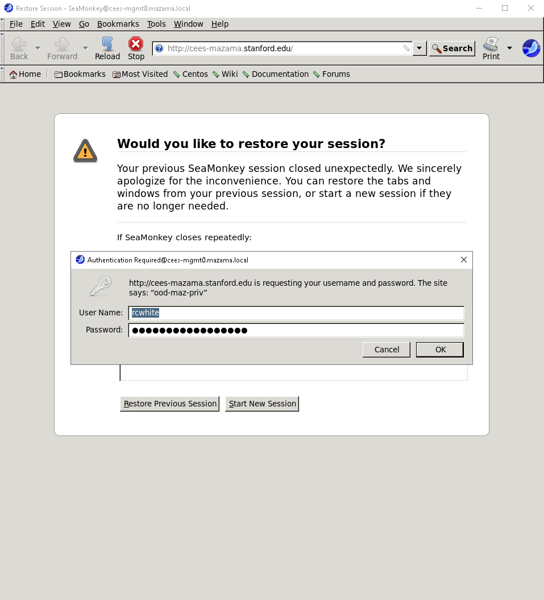

The Mazama OnDemand **Dashboard** will then open. From there, you can use the
menus across the top of the page to manage files, get a shell on Mazama,
submit jobs or open interactive applications such as Jupyter Notebooks or
RStudio sessions.

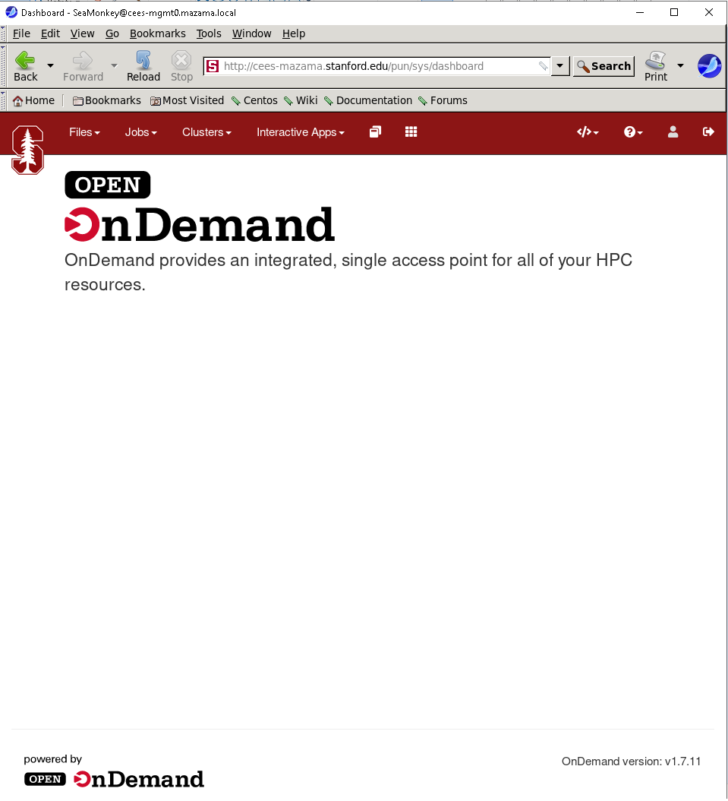

To end your Mazama OnDemand session, click on the ["Log Out"][url_ood_logout]
link at the top right of the Dashboard window and close your browser.

## Getting a shell

You can get shell access to Mazama by choosing **Clusters > _Mazama Shell
Access** from the top menu in the OnDemand **Dashboard**.

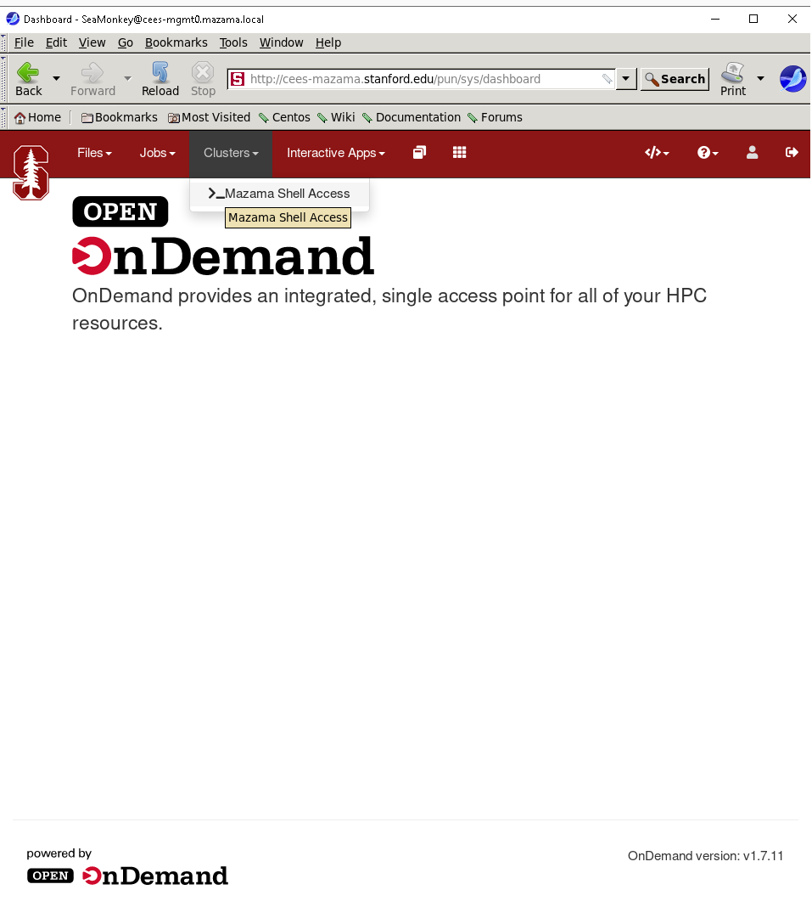

In the window that will open, you'll be logged in to one of Mazama' login
nodes, exactly as if you were using SSH to connect. Except you don't need to
install any SSH client on your local machine, or deal with your SSH client 
configuration to. 

How cool is that?

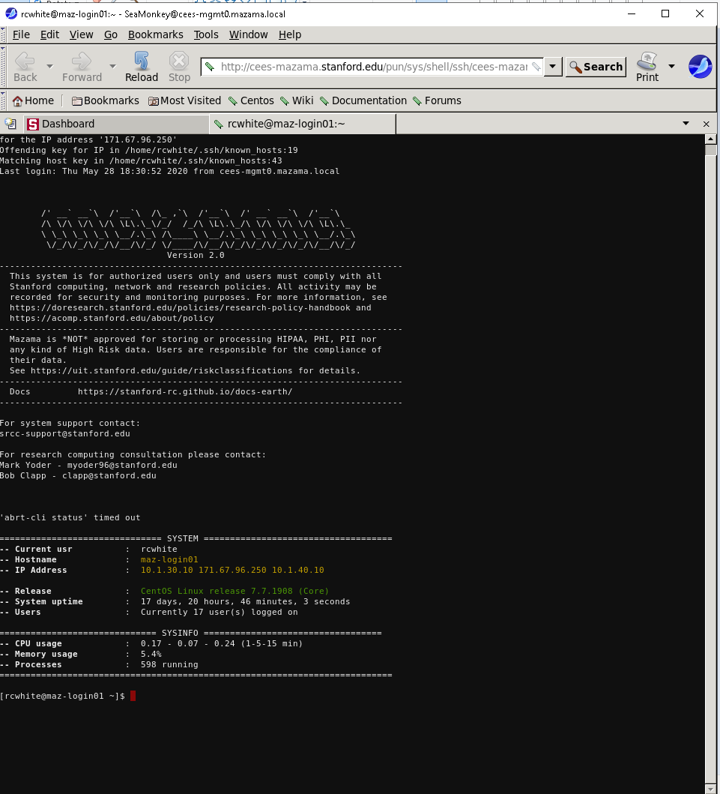

## Managing files

To create, edit or move files, click on the **Files** menu from the
**Dashboard** page. A dropdown menu will appear, listing your most common
[storage locations][url_storage] on Mazama: `$HOME`, `$DATA`,
`$DATA2`. `$DATA3` and `$SCRATCH`.

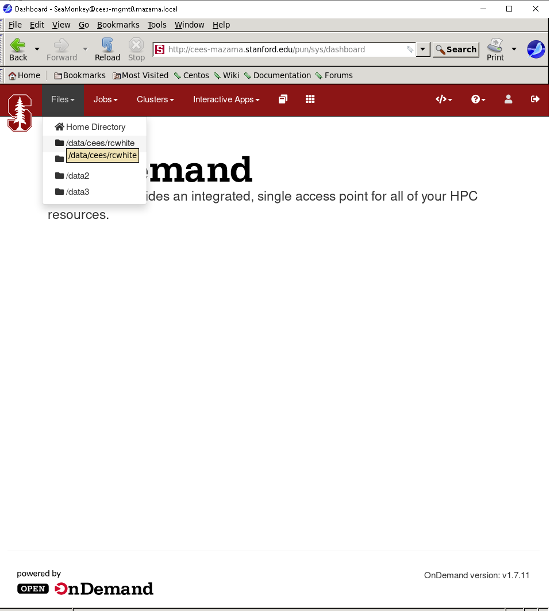

Choosing one of the file spaces opens the **File Explorer** in a new browser
tab. The files in the selected directory are listed.

!!! note "Left panel will always display `$HOME`"

    No matter which directory you are in, your home directory is displayed in a
    panel on the left.

There are two sets of buttons in the File Explorer.

* On the top left, just below the name of the current directory:
  Those buttons allow you to
  **View**, **Edit**, **Rename**, **Download**, **Copy**, **Paste** (after you
  have moved to a different directory) or **Delete** a file, or you can toggle
  the file selection with **(Un)Select All**.

* At the top of the window, on the right side:
  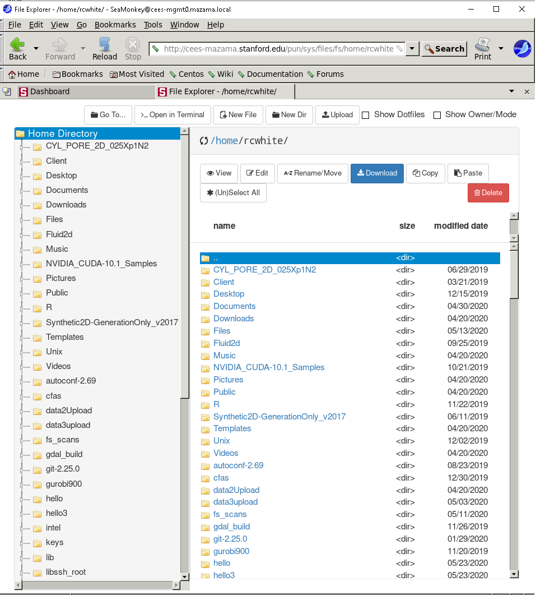

    | Button | Function |
    | ------ | -------- |
    | **Go To** | Navigate to another directory or file system |
    | **Open in Terminal** | Open a terminal window on Mazama in a new browser tab |
    | **New File** | Create a new, empty file |
    | **New Dir** | Create a new subdirectory |
    | **Upload** | Copy a file from your local machine to Mazama |
    | **Show Dotfiles** | Toggle the display of dotfiles (files starting by a `.`, which are usually hidden) |
    | **Show Owner/Mode** | Toggle the display of owner and permisson settings |
    

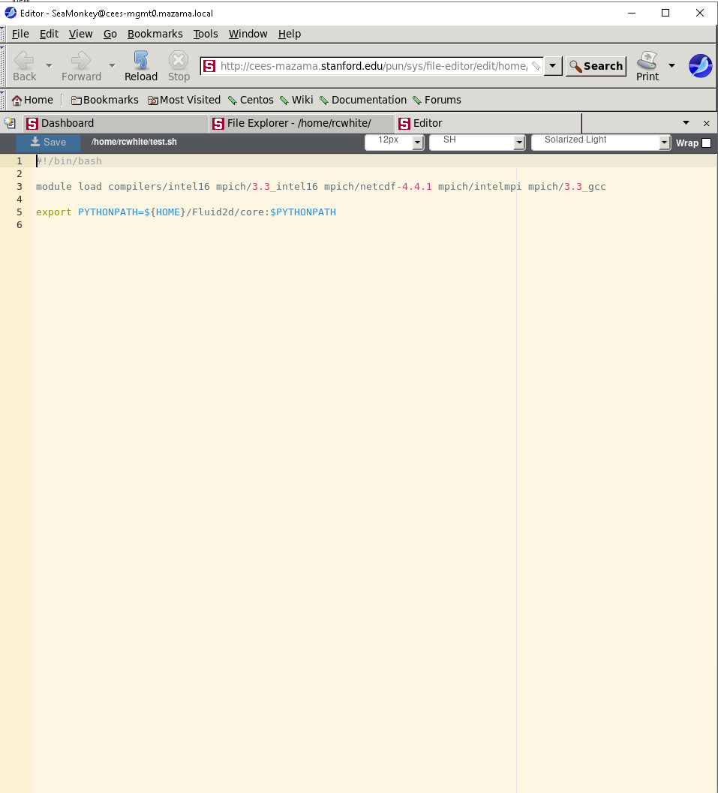

## Creating and editing jobs

You can create new job scripts, edit existing scripts, and submit them to the
scheduler throught the Mazama OnDemand interface.

From the top menus in the **Dashboard**, choose **Jobs > Job Composer**. A Job
Composer window will open. There are two tabs at the top: **Jobs** and
**Templates**.

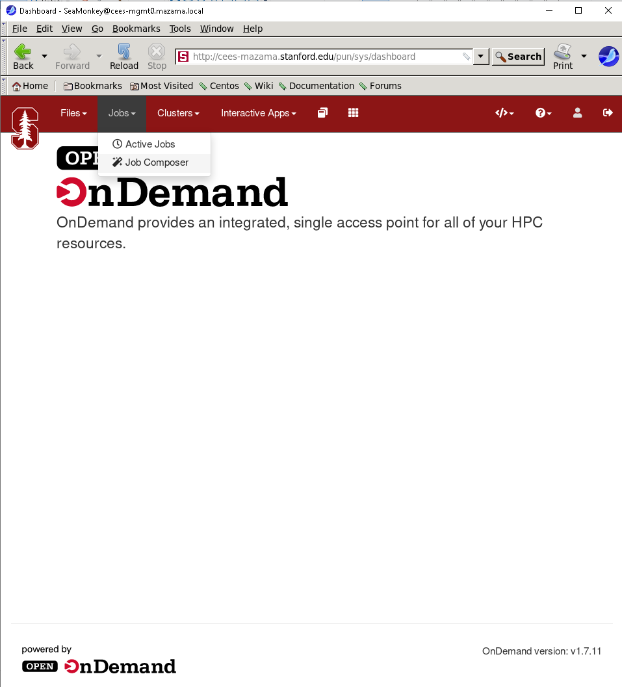

In the **Jobs** tab, you'll find a list of the job you've submitted through
OnDemand. The **Templates** tab will allow you to define your own job
templates.

### Creating a new job script

To create a new job script. you'll need to follow the steps below.

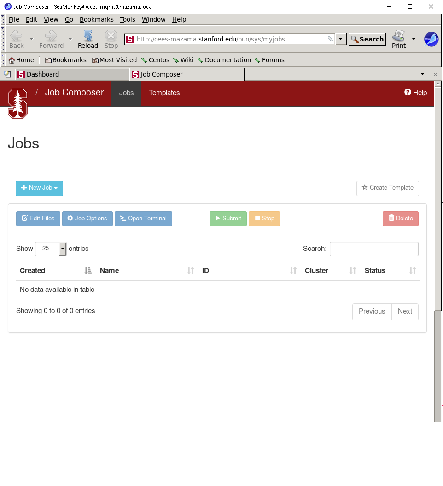

#### Select a template

Go to the **Jobs** tab in the **Jobs Composer** interface. You'll find a
default template there: "_Simple Sequential Job_".

To create a new job script, click the blue **New Job > From Default Template**
button in the upper left. You'll see a green message at the top of the
page indicating: "Job was successfully created".

At the right of the **Jobs** page, you can see the **Job Details**, including
the location of the script and the script name (by default, `main_job.sh`).
Under that, you will see the contents of the job script in a section named
**Submit Script**.

#### Edit the job script

You'll need to edit the job script, so it contains the commands and workflow
that you want to submit to the scheduler.

If you need more resources than the defaults, you must include options to
change them in the job script. 

You can edit the script in several ways:
* click the blue **Edit Files** button at the top of the **Jobs** tab in the
  Jobs Composer window,
* in the **Jobs** tab in the **Jobs Composer** window, find the **Submit
  Script** section at the bottom right. Click the blue **Open Editor** button.

After you save the file, the editor window remains open, but if you return to
the **Jobs Composer** window, you will see that the content of  your script has
changed.

#### Edit the job options

In the **Jobs** tab in the **Jobs Composer** window, click the blue **Job
Options** button. The options for the selected job such as name, the job script
to run, and the account it run under are displayed and can be edited. Click
**Save** or **Cancel** to return to the job listing.

## Submitting jobs

To submit a job, select in in the **Jobs** tab in the **Jobs Composer** page.
Click the green **Submit** button to submit the selected job. A message at the
top of the window shows whether the job submission was successful or not. If it
is not, you can edit the job script or options and resubmit. When the job is
submitted successfully, the status of the job in the **Jobs Composer** window
will change to _Queued_ or _Running_. When  the job completes, the status will
change to _Completed_.

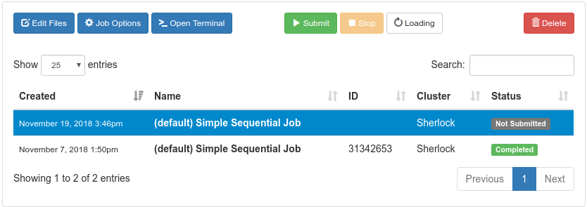

## Monitoring jobs

From the **Dashboard** page, The **Jobs > Active Jobs** top-level menu will
bring you to a live view of Mazama's scheduler queue. You'll be able to see
all the jobs currently in queue, including running and pending jobs, as well as
eome details about individual jobs.

At the bottom of the detailled view, you'll find two button that will bring you
to the directory where that job's files are located, either in the **File
Manager** or in a **Shell** session.

## Interactive applications

One of the main features of Mazama OnDemand is the ability to run
interactive applications difrectly from the web interface, without leaving your
web browser.

### VNC

To run a VNC session via Mazama OnDemand:

1. Select **Interactive Apps > Mazama Desktopr** from the top menu in the
   Dashboard page,
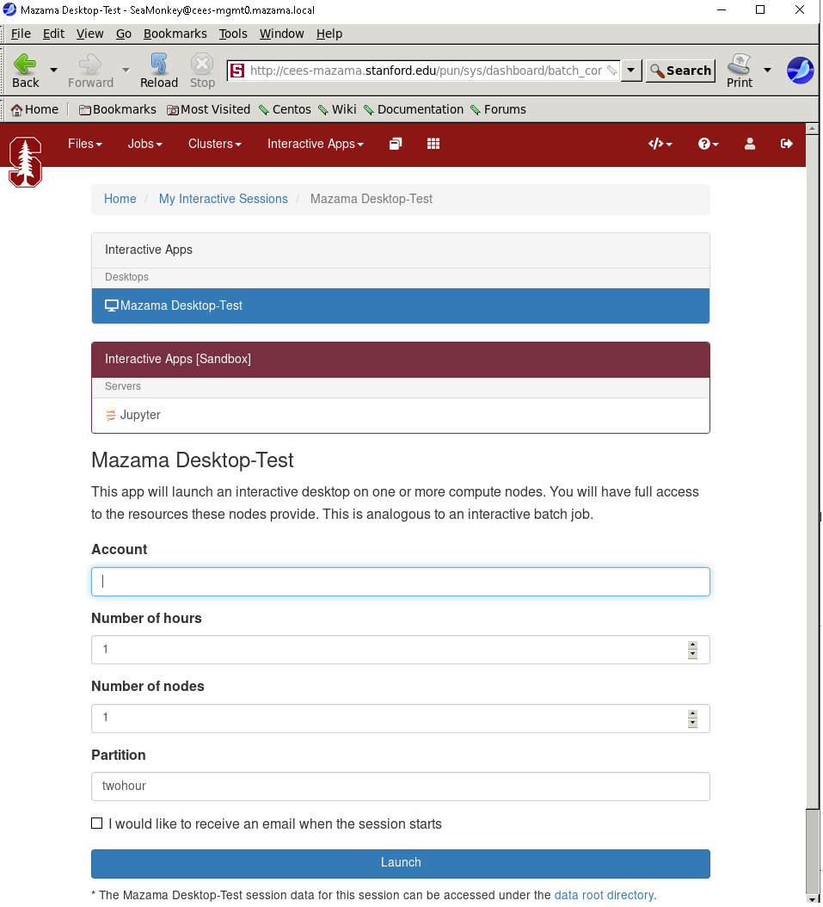
2. In the screen that opens, specify the different parameters for your job
   (time limit, number of nodes, CPUs, partition to use, etc.). You can also
   choose to be notified by email when your notebook start.

3. Click the blue **Launch** button to start your RStudio session. You may have
   to wait in the queue for resources to become available.
   
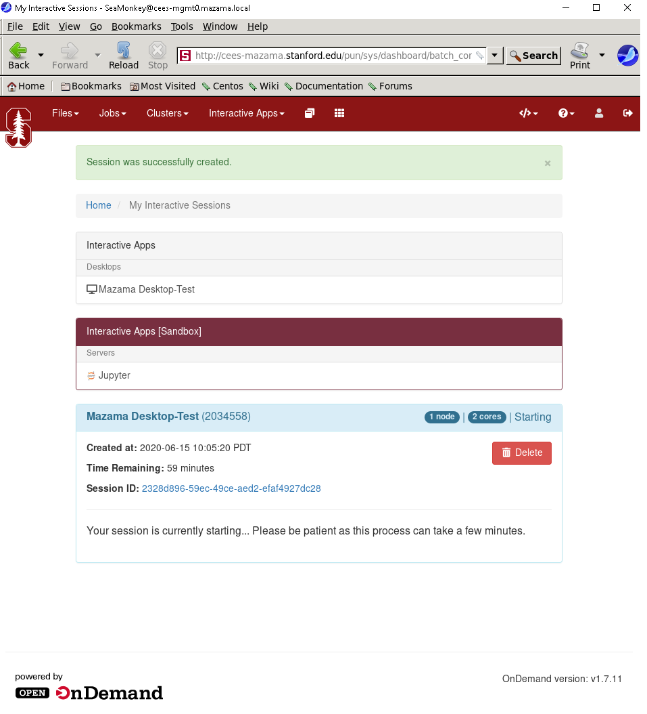

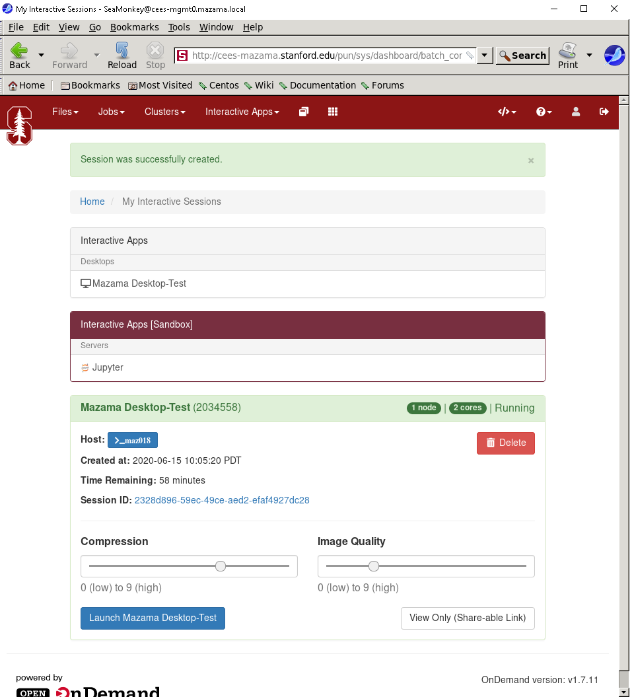

4. When your session starts, click the blue **Launch Mazama Desktop**
   button. A new window shall open with a VNC Session running XFCE4.

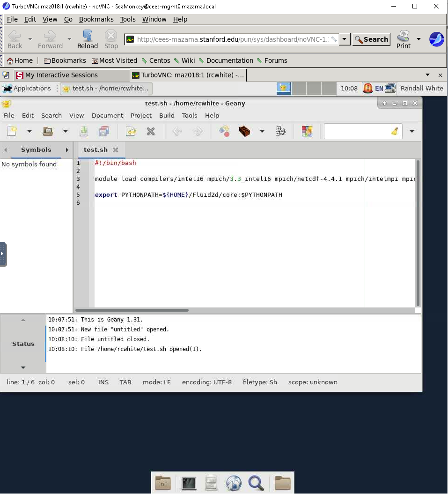

### JupterLab
***!!COMING SOON!!***

### Rstudio Server
***!!COMING SOON!!***

### Tensorboard
***!!COMING SOON!!***

[comment]: #  (link URLs -----------------------------------------------------)

[url_osc]:          https://www.osc.edu
[url_ood]:          https://openondemand.org
[url_ood_docs]:     https://www.osc.edu/resources/online_portals/ondemand

