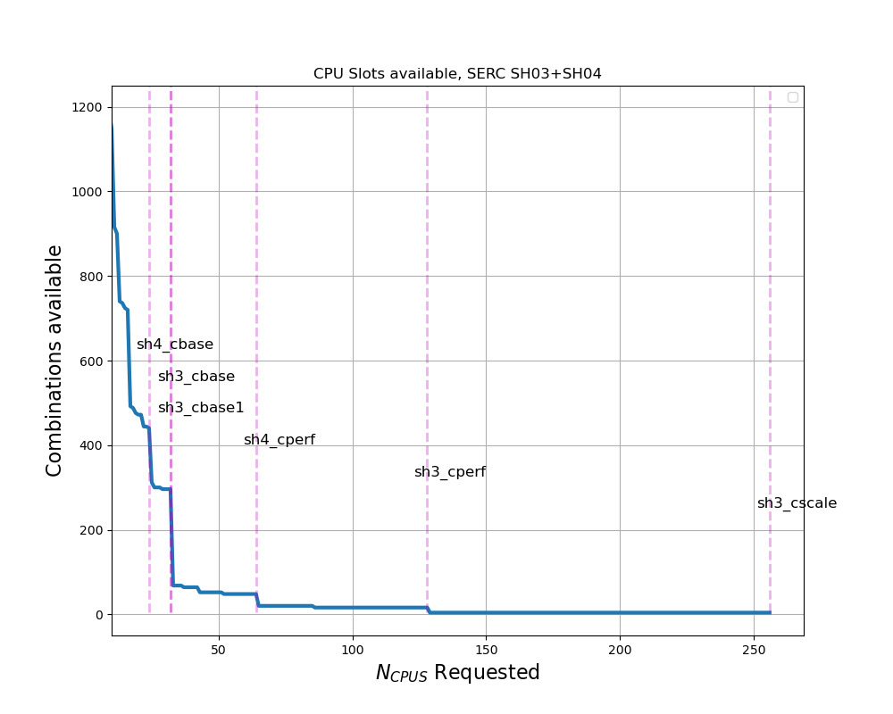

# SDSS-CC Overview
Stanford Research Computing's _Sherlock_ HPC platform is SDSS's principal compute resource. As detailed below, this includes the public partitoins, available to all Sherlock users (which includes all PI gropus at Stanford) and the `serc` partition, which is shared by Stanford Doerr School of Sustainability (SDSS) research groups. Where Sherlock is not an appropriate, or insufficient platform, SDSS-CC may support alternative options, including:
  - Google Cloud (GCP) projects
  - ACCESS, and other National Labs, NASA, and other public research computing facilities.

# Sherlock partitions
Sherlock is configured in the "condo" model, which means that -- in addition to a handful of special purpose public partitions (see below),  Sherlock is divided into many (small) PI owned partitions. PI groups who buy into the model have exclusive access to resource in their partition and are also granted access to machines in the `owners` partition (see below).

This differs from the partitioning in larger, National Labs scale computing centers, where partitions are likely defined by hardware type and access to resrouces is controlled by Accounting and some form of pay- or apply for- service. For example, a user might be granted 10k CPU hours on a system; their use is tracked by SLURM  (or a different job controller software) Accounting.

The various hardware configurations in Sherlock can significantly affect job performance and resource availabiltiy, so it is important to understand what resources are available, what are the performance characteristics of those resources, and how to request those resoruces to optimize job performance.

## Public Partitions
  - `normal`: Default partition; mostly standard `CBASE` machines from the various Sherlock generations
    - Good for: General CPU compute, batched jobs
    - Bad for: No GPUs; `normal` is typically highly oversubscribed, so expect long waits for interactive sessions
  - `dev`: Development partition. Restricted to short jobs with small resource allocations.
    - Good for: Development, short interactive sessions, testing codes
    - Bad for: Batch not available; large allocations are not permitted.
  - `gpu`: Public partition containing GPUs
    - Good for: GPU jobs! Includes high performance A100s and H100s, as well as lower performance -- but more accessible, devices (eg, L40)
    - Bad for: GPUs are in high demand, so this partition can be highly oversubscribed.
  - `bigmem`: Large memory machines
    - Good for: Jobs that require very lareg memories or mem-per-cpy (up to 4 TB, or 64 GB/CPU) 
    - Bad for: Run times are restricted; this partition can be busy.
  - `owners`: Virtual partition containing all (otherwise) unallocated resources, available to partition owners.
    - Good for: LOTS of available CPUs! Great for running large ensembles of small(ish) jobs
    - Bad for: Jobs are preemptable (will be killed if an owner requests that resource), so long running and large (eg, mult-node MPI jobs) allocations may not finish.
  
# SERC Partition
## Overview
SERC is a large partition, shared by SDSS researchers. In short, SERC constitutes SDSS's principal compute platform and includes a variety of resources to facilitate different types of computation. Modes of compute include interactive Jupyter Notebooks, multi-node MPI simuations, single task (node) serial or thread-based (OpenMP, etc.) 

## General Compute

### SH3_CBASE, SH3_CBASE.1 (104, 96)
- 32 CPUs (1 x AMD Epyc 7502) 256 GB
Excellent general purpose machines; highly suitible for MPI and OMP parallel jobs. Note there are two generations of these machines (CBASE and CBASE.1), which feature
slightly different processors and other characteristics. CBASE and CBASE.1 machines should typically be considered distinct hardware for MPI jobs (see below for more about MPI jobs and hardware constraints)

### SH4_CBASE (128)
- 24 CPUs (1 x AMD Epyc 8224p) 192 GB
Excellent general purpose machines; highly suitible for MPI and OMP parallel jobs.

## Performance Compute
### SH4_CPERF (16)
- 64 CPUs (2x AMD Epyc 9384X), 384 GB
SH4_CPERF are high performance machines that are very well suited to CPU limited MPI and OMP parallel jobs. These machines provide excellent opportunity to take advantage 
of highly optimized parallel codes. The 9384X processor has sufficient memory bandwidth to compute more or less unrestricted on all CPU cores. Well optimized, cpu-limited jobs should perform well on these machines and will likely benefit by waiting for allocations to be fulfilled on them.
- To restrict a job to use only SH4_CPERF machines: `--constraint="CLASS:SH4_CPERF"`

## High Capacity Nodes
### SH3_CPERF (8)
- 128 CPUs (2x AMD Epyc 7742), 1024 GB
SH3_CPERF machines are optimally suited for interactive jobs, general copute that is not CPU limited, and jobs that require large memories. Note that these machines have a lot of CPUs, but the processors are highly memory bandwith limited, so their performance will start to level off around 60-70 CPUs. This is to say that an OMP job running on all 128 CPUs will perform only marginally (if at all...) faster than a job running on half as many CPUs. In short, these machines are not especially well suited for massive OMP parallelization or large MPI jobs.

### SH4_CSCALE (4)
- 256 CPUs (2 x AMD Epyc 9754), 1.5 TB
SH4_CSCALE machines are excellent for interactive jobs, jobs that require large memories, and tasks that are not CPU limited. Like SH3_CPERF, SH4_CSCALE have loads of CPUs, but
are highly memory bandwidth limited, and so parallel performance will saturate relativley quickly.

## GPUs:
SERC presently includes 88 NVIDIA A100 and 8 H100 GPUs, as part of the SH04 acquisition. Another 8 V100 devices will be decomissioned with SH02, sometime in 2025. Note that these machines are very expensive and in very high demand, so it is important that GPU jobs exercise optimized worflows and codes that use these valuable resources efficiently and effectively.

In particular IO performance can often be significantly improved and memory requirements dramatically reduced (or at least better controlled and regulated) by pre-processing input data into HDF5, NetCDF, or similar data formats. This often can be accomplished in a few short paragraphs of code, can reduce memory requirements to easily -- and predictably, fit within the `128/256 GB/GPU' system RAM on SERC's A/H100 machines, and improve compute performance by a factor of betwen 10 and 100. Examples in this documentation include [HDF5 image examples](../data/h5py-examples), [HDF5 I/O performance](../data/hdf5-io-performance), and [DICOM and HDF5](../data/dicom-hdf5).

### SH3_G4TF64 (2/8)
- 4 x A100 (80 GB vRAM), 64 CPUs (1 x AMD Epyc), 512 GB RAM
### SH3_G8TF64 (10/80)
- 8 x A100 (6@40 GB, 4@80GB vRAM), 128 CPUs (2 x AMD Epyc), 1024 GB RAM
### SH4_G8TF64 (1/8)
- 8 x H100 (80 GB vRAM), 64 CPUs (2 x Intel 8462Y), 2048 GB RAM

# Selecting hardware

Specific hardware configurations can be requested using the `--constraint` SLURM directive. When selecting hardware, consider not only the compute requirements, but what resources are available in the partition. As shown in the figure to the right -- which shows the availability of CPU combinations for SERC SH03+SH04 (circa 2025), as a function of CPUs requested, small changes in a resource request can have a large impact on the number of resources available to fulfill the request.

For example:
- A request for a single CPU can be satisfied by any CPU in the partition
- There are half as many 2 CPU slots available, as compared to a single CPU request.
- For `n>12`, an SH4_CBASE node can host only one (not two) and a `SH3_CBASE` node can host only 2 (not 3) jobs, so we see a discrete drop
- `--cpus-per-task=24` can be satisfied at least once by all SERC HW configurations
- A request for `--cpus-per-task=25` will exclude all of the `SH4_CBASE` machiunes
- `--cpus-per-task>=33` will restrict the job to `SH3_CPERF`, `SH4_CPERF`, and `SH4_CSCALE`, etc.

To see a list of labels available to use with `--constraint`, run the command, `sh_node_feat -p serc`

## Single Task Jobs:
For Single task (most) jobs, hardware selection is nominally of second order importance -- as compared to MPI jobs (see below). For most single task jobs, SLURM math will be more important than clock speed or memory bandwidth -- in other words, in most cases, the most flexible request will be the fastest path to results. Even if a job is assigned slower hardware, it will wait less time in the queue. Nonetheless, for single task jobs, hardware selection should
take into account:
- Memory (per-cpu) requirements
- Is the job CPU limited? Can it take advantage of higher performance CPUs, and is it worth waiting for them?
- Interactive jobs, particularliy for development purposes, are rarely CPU limited
- SH3_CPERF and SH4_CASCALE are often excellent choices for interactive work, eg. `--constraint="CLASS:SH3_CPERF | CLASS:SH4_CSCALE"`
- Single task, high performance OMP jobs might benefit from the high memory bandwidth (MBW) and CPU count on `SH4_CPERF` machines, eg `--constraint="CLASS:SH4_CPERF`
- Ordinary, compute intensive jobs might be steared away from SH3_CPERF and SH4_CSCALE machines, given their MBW limitations, and so `--constraint="CLASS:SH3_CBASE | SH3_CBASE.1 | CLASS:SH4_CBASE | CLASS:SH4_CPERF` .

## MPI Jobs
It is important that MPI jobs run on homogeneous hardware configurations. Firstly -- assuming the job domains are well balanced, an MPI job with a heterogeneous configuration 
will always wait on its slowest MPI rank. Additionally, it is _possible_ that different buffer sizes, etc. on the various machines can cause data exchange errors or slowdowns
resulting from other mistmatches betweenthe HW and operating systems. Considerations to tak into account for MPI jobs include:
- How many nodes of a given type are available?
- What are the memory requirements (this is probably a non-issue, given that most MPI jobs use `<1GB/cpu`
- Can the code use OMP parallelization concurrently with MPI?
- Most MPI jobs should use homogeneous hardware and exclude the MBW limited nodes: `--constraint="[CLASS:SH3_CBASE | CLASS:SH3_CBASE.1 | CLASS:SH4_CBASE | CLASS:SH4_CPERF ]"`

Note the square brackets `[ ]` tell SLURM to fulfill the request with "all of this, or that, or the other," so any one of those classes might be used but all selected nodes will satisfy the same requirement -- in this case, all machines will be of the same "class."

## GPU Jobs
GPU hardware can be specified by a handful of constraints, depending on the specific requirement. Again, looking at the output from `sh_node_feat -p serc`, the features `GPU_GEN:VLT`, `GPU_GEN:AMP`, and `GPU_GEN:HPR` can be used to select `V100` (to be retired with SH02 hardware), `A100`, or `H100` GPUs, respectively. Similarly, GPU memory may be used as a discriminator, eg. `--constraint=GPU_MEM:80GB`. Some examples of constraint specifications include:
- Require A100 or H100, but both the same: `--ntasks=1 --gpus=2 --constraint="[GPU_GEN:AMP|GPU_GEN:HPR]"`
- Require A100 or H100; allow mixing: `--gpus=2 --constraint="GPU_GEN:AMP|GPU_GEN:HPR"`
    - NOTE: This constrain _requires_ a multi-node allocation, and so should be used only for codes that use MPI (or similar framework) to communicate betwen nodes.
- Require 80 GB vRAM: `--constraint="GPU_MEM:80GB"`

Note also that SLURM might, by default, fulfill a request for multiple GPUs (eg, `--gpus=4`) on multiple tasks and nodes. Unless multi-node parallelization is explicitly enabled, most codes and frameworks will only parallelize across GPUs (or CPUs) on one machine (shared memory or thread based parallelization), so multiple GPU allocations will be wasted. Unless a code is _explicitly_ known to handle multi-node parallelization (eg. MPI), multi-GPU jobs should include the `--ntasks=1` SLURM directive (resource request).

