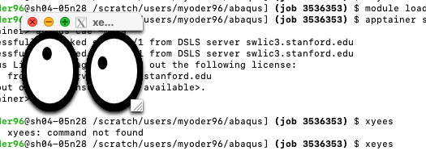
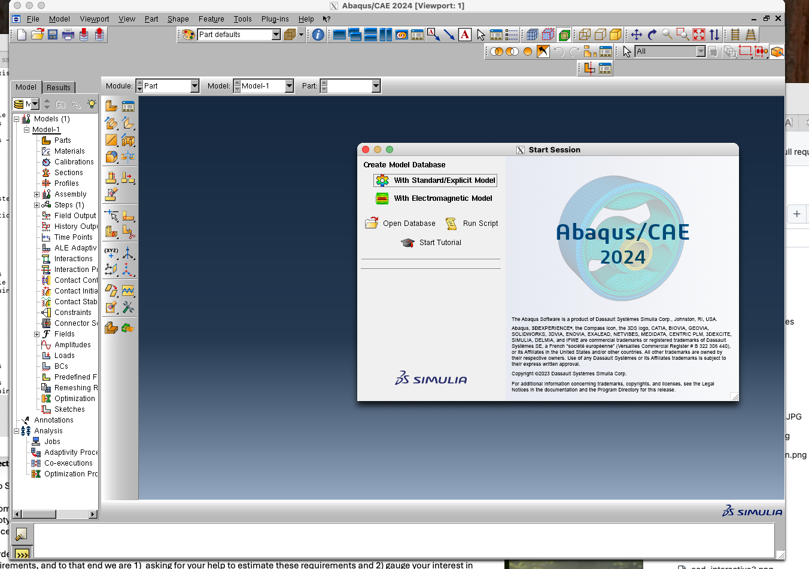

# ABAQUS on Sherlock

## Introduction
For various reasons, ABAQUS -- particularly newer versions, wil likely not install directly on Sherlock, but it can be built and run in a container. _Apptainer_ is the preferred container software for Sherlock. _Podman_ is also a viable option -- thought it may require a custom installation, but -- as is common in HPC environments, _Docker_ will not run due to security restrictions.

The following discussion and instructions are specifically targeted to Stanford Research Computing's _Sherlock_ HPC platform, but minor modifications to specific paths, module names, and variable names -- eg. `$SCRATCH`, can taylor this approach to just about any Linux based HPC environment. Note also changes migh tbe made to contaienrs, module scripts, batch scripts, etc. to simplify runtime experience, so this document should be viewed as a source of guidance, not a comprehensive copy-paste recipe for operation.

## Containers on Sherlock
A `v2024` container can be accessed in the SDSS shared software and modules,

```
module use /home/groups/sh_s-dss/share/sdss/modules/modulefiles
module load abaqus/
```

From there, there are multiple ways to run ABAQUS, namely either as an interactive `shell`, by using the `exec` subcommand, or there may be a runscript -- so using `run`. For testing and training, a ToyModel is included alongside the container in,

```
$ABAQUS_ROOT/ToyModel_FullElastic_Test
```

## Interactive Jobs
To run ABAQUS against this toy model interactively, create a workspace, copy the toy model, and run ABAQUS from a shell, eg:

```
# setup:
mkdir ${SCRATCH}/abaqus_workspace
cd ${SCRATCH}/abaqus_workspace
cp -r ${ABAQUS_ROOT}/ToyModel_FullElastic_Test ./
cd ToyModel_FullElastic_Test
#
# note some helper variables:
echo ${ABAQUS_ROOT}
/home/groups/sh_s-dss/share/sdss/software/abaqus/2024
#
# launch a container shell
apptainer shell ${ABAQUS_ROOT}/abaqus_2024.sif
abaqus job=any_job_name input=ToyModel_FullElastic.inp interactive cpus=${SLURM_CPUS_ON_NODE}
```

Note that the `interactive` option runs ABAQUS in the foreground, as opposed to the default behavior which forks ABAQUS to the background. In a `shell` environment, either is a valid choice. On the one hand, running in foreground is a bit more intuitive and it is more obvious when the job completes. On the other hand, it is easier to monitor the job -- eg, using `ps` or `htop` to show CPU activity or viewing output files, if the job is running in the background.

### CAE GUI
The ABAQUS CAE GUI can also be run from this container. The current implementation of CAE is based on X11, so it is necessary to enable X11 forwarding in both the login and compute node sessions. For more details, see [../sherlock/x11-forwarding](../sherlock/x11-forwarding). In summary:

Enable X11 in the login session with the `-X` option:

```
ssh -X sherlock.stanford.edu
```

Then load X11 modules and enable `--x11` in your SLURM request, eg.

```
module load system x11
salloc --partition=serc --cpus-per-task=8 --time=08:00:00 --mem-per-cpu=4g --x11=all
```

Test your X11 forwarding by running the `xeyes` applcation:

```
xeyes
```


If X11 is working correctly, launch a shell container, then lanch the CAE application. Messaging should show QAE license(s) being checkedc, out

```
$ apptainer shell ${ABAQUS_ROOT}/abaqus_2024.sif
Apptainer> abaqus cae -mesa
Successfully checked out QAE/1 from DSLS server swlic3.stanford.edu
Successfully checked out R4U/1 from DSLS server swlic3.stanford.edu
Abaqus License Manager checked out the following license:
"QAE" from DSLS server swlic3.stanford.edu
<39 out of 40 licenses remain available>.
```

Then the GUI will launch in an X window:



If X11 forwarding is not working correctly, eg. you get a message akin to, `Error: Can't open display: localhost:91.0`, most likely either:
- You did not enable X11 forwarding in your base `ssh` session, eg `ssh -X`
- You did not enable X11 in your `SLURM` request, eg. `salloc --x11=all`
- You did both of these, but your connection is multiplexing with an earlier connection that does not use `-X` or `-Y`
- You did all of these things, but your X11 forwarding has gone stale

Typically, before spending a lot of time adding or modifying packages and rbuilding the container, the best solution is to completely log out of all Sherlock sessions, then log back into Sherlock, testing X11 forwarding, eg with the `xeyes` application, as you go.

## Batch Jobs
For batched (non-interactive) jobs, the `interactive` parameter -- somewhat conunterintuitively is required, because the container's `exec` mode may otherwise interpret its task to be completed and terminate itself. For example,

```
# create a workspace directory, then reference the input file by its full path.
mkdir workspace
cd workspace
#
apptainer exec $ABAQUS_ROOT/abaqus_2024.sif abaqus job=MyJob input=/scratch/users/myoder96/abaqus/ToyModel_FullElastic_Test/ToyModel_FullElastic.inp interactive cpus=8
Old job files exist. Overwrite? (y/n): y
Analysis initiated from SIMULIA established products
Abaqus JOB MyJob
Abaqus 2024
Successfully checked out SRU/35 from DSLS server swlic3.stanford.edu
Abaqus License Manager checked out the following licenses:
Abaqus checked out 35 tokens from DSLS server swlic3.stanford.edu.
<1058 out of 1320 licenses remain available>.
Begin Analysis Input File Processor
Fri Aug  8 08:05:31 2025
Run pre
Fri Aug  8 08:05:41 2025
End Analysis Input File Processor
Begin Abaqus/Standard Analysis
Fri Aug  8 08:05:41 2025
Run standard
...

```
If `interactive` is omitted, the job starts but the container exits immediately
```
apptainer exec $ABAQUS_ROOT/abaqus_2024.sif abaqus job=MyJob input=/scratch/users/myoder96/abaqus/ToyModel_FullElastic_Test/ToyModel_FullElastic.inp  cpus=8
Old job files exist. Overwrite? (y/n): y
INFO:    Terminating fuse-overlayfs after timeout
INFO:    Timeouts can be caused by a running background process
```
Note that, as briefly mentioned above, the input `*.inp` file can be accessed remotely -- by specifying a path, and the output data will be written tot the local path, so it is not necessary to copy the input directory for each run.

## Building a container
The existing ABAQUS container(s) on Sherlock are free to use, copy, and distribute. If for some reason -- better integration with a different HPC, updated version, professional curiosity, academic masochism, you want to build a new container, we discuss that process here. This section will almost certainly not be especially neat, and as discussed above should be considered a guide -- by no means a copy-paste recipe. The main objective here is to lay out a viable path and address some of the esoderities of the process.

### Acquiring the media
For Stanford affiliates, the software can be acquired, likely free of charge, from the Stanford Software Licensing WebStore; start here:
- [https://uit.stanford.edu/service/softwarelic](https://uit.stanford.edu/service/softwarelic)
- [https://stanford.onthehub.com/WebStore/ProductsByMajorVersionList.aspx](https://stanford.onthehub.com/WebStore/ProductsByMajorVersionList.aspx)

After submitting a request for installation media, you will receive an email with a link or instructions to download that media. You will end up with a set of files, like:

```
$ ls -lh /oak/stanford/schools/ees/admins/yoder/abaqus/2024.x/
total 19G
-rw-------+ 1 myoder96 oak_s-ees 3.2G May 27 12:06 2024.AM_SIM_Abaqus_Extend.AllOS.1-6.tar
-rw-------+ 1 myoder96 oak_s-ees 3.2G May 27 12:06 2024.AM_SIM_Abaqus_Extend.AllOS.2-6.tar
-rw-------+ 1 myoder96 oak_s-ees 3.2G May 27 12:05 2024.AM_SIM_Abaqus_Extend.AllOS.3-6.tar
-rw-------+ 1 myoder96 oak_s-ees 3.2G May 27 12:06 2024.AM_SIM_Abaqus_Extend.AllOS.4-6.tar
-rw-------+ 1 myoder96 oak_s-ees 3.2G May 27 12:06 2024.AM_SIM_Abaqus_Extend.AllOS.5-6.tar
-rw-------+ 1 myoder96 oak_s-ees 3.2G May 27 12:05 2024.AM_SIM_Abaqus_Extend.AllOS.6-6.tar
```

These will unpack into a parent subdirectory and "bundles",

```
└── AM_SIM_Abaqus_Extend.AllOS
    ├── 1
    ├── 2
    ├── 3
    ├── 4
    ├── 5
    └── 6
```
### ABAQUS Installers
Installation instructions can be found here:

[https://www.goengineer.com/blog/how-to-install-abaqus](https://www.goengineer.com/blog/how-to-install-abaqus)

The installer scripts are most likely in the first bundle directory; they are:
- `StartGUI.sh`: GUI based installer for Linux
- `StartTUI.sh`: Terminal based installer for Linux
- `setup.exe`: GUI installer for Windowsw
- `StartTUI.exe` Terminal based installer for Windows

### Container specifications
For some HPC systems and personal workstations/laptops, the installer programs can be run directly. For Sherlock, ABAQUS must be installed into a container. Sherlock -- like most shared HPC environmebnts, does not support Docker (the most popular container system), but it does support Apptainer (formerly Singularity). PodMan is another option, but may require the user to install it. Here, we focus on Apptainer.

There are a couple of ways to build the container; we followed these basic steps:
1. Download the media and expand to a workspace on Sherlock (see above)
2. Build a base container that satisfies all of ABAQUS' dependencies
3. Install ABAQUS interactively, using `apptainer shell` and `StartTUI.sh`
   - NOTE: The ABAQUS install may require ~10GB storage, but the container's writable temporary space will be ~60 MB (which is less). On some systems, building with `--sandbox` then running with `--writable` may allow the large installation. Another approach is to `--bind` a writable space, eg. `--bind $(pwd)/temp:/SIMULIA`, then install all applications to `/SIMIULIA`
5. Recover the installation configuration files:
   - UserIntentions_CODE.xml
   - UserIntentions_CAA_Additional_426.xml
6. Re-build the container, but enable commands in `%post` to run the installer in "silend" mode, eg `StartTUI.sh silent` (see container .def file)

Note that the precise execution of steps 4 and 5 is not well defined. Nominally the "right" way to do this is to build the base container, run the interactive installation as per (4), then build a second container -- that runs the silent install, derived from the original base container, or possibly to define a multi-stage build. All three of these approaches -- and others to be sure, are valid enough. One advantage of this approach is that we have only one `*.def` file, even if we do need to modify it during the build process. 

Note also -- as will be made clear when we work through these steps in more detail, that rather than copy the SW source into the container, we mount or "bind" to it. Either approach is fine. Using `--bind` or `-B` is faster and can be done independent of the location of the source files; copying the SW source into the container, eg in the `%files` section defines the location of those files in the `.def` script, but also nominally requires that the be sourced from a specific path -- so again, both approaches are correct, wrong, and good enough.

Given the various requirements, including a current GLIB-C library and other compatibility requirements, we chose Rocky Linux v9 (Rocky9) for the container OS. The container def file is posted below.

### Build the Container: Interactive install
There is no one way to do this. A good start is to create a workspace into which we copy or create our `.def` file.

```
mkdir -p ${SCRATCH}/abaqus/build_workspace
cd ${SCRATCH}/abaqus/build_workspace
```

In this scenario, the installation media are in,
```
${SCRATCH}/abaqus/2024.x/AM_SIM_Abaqus_Extend.AllOS
```

Build the container. 
```
apptainer build abaqus.sif abaqus.def
```

or for a 'sandbox' container -- which should be optinally writable,

```
apptainer build --sandbox abaqus_sbx abaqus.def
```

If necessary, create a temp space to write installation files, then launch a container shell and run `StartTUI.sh` interactively. Note that we are mapping the local directory `output_tmp` to `/SIMULIA` inside the container. We will direct our installations to `/SIMULIA`, circumventing the "not enough space" error.
```
$ mkdir output_tmp
$ apptainer shell --bind ${SCRATCH}/abaqus/2024.x/AM_SIM_Abaqus_Extend.AllOS:/ABAQUS --bind $(pwd)/output_tmp:/SIMULIA --writable-tmpfs abaqus.sif
Apptainer> /ABAQUS/1/StartTUI.sh
 INFO: Initial CurrentMediaDir="/ABAQUS/1"
       Computed CurrentMediaDir="/ABAQUS/1"
 INFO: Current operating system: "Linux"
 INFO: DSY_OS="linux_a64"
 INFO: DSY_OS_Release="rocky"
 INFO: Check Prerequisites for Linux
       Rocky Linux 9.6
       Prerequisites OK
 INFO: /ABAQUS/1/inst/linux_a64/code/bin/DSYInsAppliTUI
 INFO: Installer found in current media: "/ABAQUS/1/inst/linux_a64/code/bin/DSYInsAppliTUI".
 INFO: This media is composed of 6 volumes.
       Volume 1 found in: /ABAQUS/1
       Volume 2 found in: /ABAQUS/2
       Volume 3 found in: /ABAQUS/3
       Volume 4 found in: /ABAQUS/4
       Volume 5 found in: /ABAQUS/5
       Volume 6 found in: /ABAQUS/6
...
```

Follow the prompts. Select the products to install. Note that this container can get pretty large, so that should be a consideration, eg.

```
________________________________________________________________________________

   SIMULIA 2024 Established Products
________________________________________________________________________________

Select the medias you want to install
Input !b to get the previous page. Input !q and hit Enter to quit. Just press Enter to continue.

 -1 Select All
  0 Select None
  1 [ ] NETVIBES Exalead CloudView
  2 [ ] EXALEAD Search for Documentation
  3 [ ] Extended Product Documentation
  4 [ ] FLEXnet License Server
  5 [*] SIMULIA Established Products
  6 [*] SIMULIA Established Products CAA API
  7 [*] Isight

Enter selection (default: Next): 
```

When in doubt, a minimal selection is probably a good choice. Type a numer and [RETURN] to toggle the value of a selection. When asked about an install location, any place (including the default) is probably fine; you may need to set some paths. In this case, since this is a container and I want to keep it simpler, I installed straight to the root, but there is no reason to assume that was a good idea:

```

   SIMULIA Established Products 2024  
________________________________________________________________________________

Choose the installation directory:
Input !c to clear the default value. Input !q and hit Enter to quit. Just press Enter to continue.

Default [/usr/SIMULIA/EstProducts/2024]: /SIMULIA
```

Select come components -- keeping in mind the container size:

```
Enter selection (default: Next): 22

 -1 Select All
  0 Select None
  1 [*] Abaqus/Standard Solver
  2 [*] Abaqus/Explicit Solver
  3 [ ] Cosimulation Services
  4 [ ] Abaqus ODB API Services
  5 [*] Abaqus CAE
  6 [ ] Abaqus Samples
  7 [ ] Tosca Structure
  8 [ ] Tosca Fluid
  9 [ ] fe-safe
 10 [ ] fe-safe interface to Abaqus 2024 ODBs
 11 [ ] fe-safe interface to Abaqus 2023 ODBs
 12 [ ] fe-safe interface to Abaqus 2022 ODBs
 13 [ ] fe-safe interface to Abaqus 2021 ODBs
 14 [ ] fe-safe interface to Abaqus 2020 ODBs
 15 [ ] fe-safe materials and surface finish specifications
 16 [ ] Material database server for fe-safe
 17 [ ] fe-safe tutorial and sample data
 18 [ ] fe-safe tutorial models for Abaqus
 19 [ ] fe-safe tutorial models for I-DEAS
 20 [ ] fe-safe tutorial models for Ansys
 21 [ ] fe-safe tutorial models for NASTRAN
 22 [*] 3DSFlow Solver

Enter selection (default: Next): 
```

Licensing has been upgraded to DSLS:
```
________________________________________________________________________________

   SIMULIA Established Products 2024  
________________________________________________________________________________

License Server Configuration

To configure licensing for this product
select the license server type.

If 'Skip licensing configuration' is chosen, the installer will
configure the product to use default DSLS licensing.
After installation completes, to manually configure licensing
see the licensing section in the documentation for your product.

Input !b to get the previous page. Input !q and hit Enter to quit. Just press Enter to continue.

  1 (X) SIMULIA FLEXnet
  2 ( ) DSLS
  3 ( ) Skip licensing configuration
Enter selection (default: Next): 2
```
I believe we set the license server in the container, but it probably does not hurt to set it here when asked:
```
License Server 1 
Input !b to get the previous page. Input !c to clear the default value. Input !q and hit Enter to quit. Just press Enter to continue.

Default [localhost]: swlic3.stanford.edu:4085
```

Again, install to `/SIMULIA/Commands` -- same idea with plugins, CAE, etc., since `/SIMULIA` is mapped (`--bind`ed) to space outside the container.

The installer will run and run and run, then stall on the `Installing interoperability files ...` step for quite some time, but then continue saying, `Please be patient;  it will take a few minutes to complete.`, whcih is true, but eventually it does, and you should see something like
```
________________________________________________________________________________

   SIMULIA 2024 Established Products
________________________________________________________________________________

The following media have been installed on your computer:

Just press Enter to exit installation.

Successful installation:
  SIMULIA Established Products

Enter selection (default: Close): 

```
### Rebuild the container with --silent install
The main installation configuration file is:
```
output_tmp/EstProducts/2024/InstallData/UserIntentions_CODE.xml

```

There might be other(s), depending on your installation options. This (these) file(s) need to be `--bind`ed or copied into the container, then referenced correctly by the `StartTUI.sh --silent` command in the `%post` sectino of the `.def` file. Note also that because we are only installing a small subset of the available packages, we will need to find the installers `StartTUI.sh` for each of those individual components. Using the original root `StartTUI.sh` will throw errors when it does not find configurations for uninstalled packages.

Noting that `UserIntentions_CODE.xml` is raferenced inside the container as,

```
/ABAQUS/5/SIMULIA_EstablishedProducts/Linux64/1/StartTUI.sh --silent /ABAQUS/install_configs/UserIntentions_CODE.xml
```

and given that we nominally want to collect those configuration files for future deployments, one approach is to copy them to a safe place, then map to it when we build the container, eg.

```
cp -r output_tmp/EstProducts/2024/InstallData ${SCRATCH}/abaqus/2024.x/AM_SIM_Abaqus_Extend.AllOS/
apptainer build --bind ${SCRATCH}/abaqus/2024.x/AM_SIM_Abaqus_Extend.AllOS:/ABAQUS --writable-tmpfs abaqus.sif
```
Note that this will copy `InstallData` to the `AM_SIM_Abaqus_Extend.AllOS`, which we map to `/ABAQUS`, where the installer should find it.


### Apptainer .def file
```
#Bootstrap: localimage
#From: ./rocky9.sif


Bootstrap: docker
From: rockylinux:9


%pre
    mkdir $APPTAINER_ROOTFS/ABAQUS


%post
    #INSTALLER="apt-get -y "
    #INSTALLER="yum-y "
    #INSTALLER="zypper --non-interactive "
    INSTALLER="dnf -y"
    #
    ${INSTALLER} update
    #${INSTALLER} install cowsay lolcat
    #
    ${INSTALLER} install which
    ${INSTALLER} install procps
    ${INSTALLER} install findutils
    ${INSTALLER} install wget unzip
    ${INSTALLER} install python3
    ${INSTALLER} install vim nano
    ${INSTALLER} install gcc
    #
    # older Abaqus might have needed these, but new Abaqus will ignore them.
    #${INSTALLER} install openmpi
    #${INSTALLER} install openmpi-devel
    #${INSTALLER} install libfabric


    ${INSTALLER} group install "Development Tools"


    ${INSTALLER} install gcc-gfortran
    ${INSTALLER} install glibc-common
    #
    # some libraries that Abaqus might need, that might not be installed (but most of them probably are by now...)
    ${INSTALLER} install libjpeg
    ${INSTALLER} install libgomp
    ${INSTALLER} install freetype
    ${INSTALLER} install ksh
    #
    # for GUI (but CAE not yet working...)
    ${INSTALLER} install mesa-libGLU
    #
    # python -> python3 link
    #python_dir=$(dirname python3)
    ##ln -s ${python_dir}/python3 ${python_dir}/python
    #ln -s /usr/bin/python3 /usr/bin/python
    #
    #cp /src/AM_SIM_Abaqus_Extend.AllOS/3/NETVIBES_Exalead_CloudView/Linux64/1/inst/linux_a64/code/bin/*.so /.singularity.d/libs/
    #
    # Lets do the license server here, acknowledging that this is sort of a dumb way to do this...
    if [[ ! -e /var/DassaultSystemes/Licenses ]]; then
        mkdir -p /var/DassaultSystemes/Licenses
    fi
    printf "swlic3.stanford.edu:4085\n" > DSLicSrv.txt
    #
    #ls -lh /ABAQUS
    # These are the installer steps. Comment out these StartTUI.sh lines when building the base container, to create the UserIntentions files.
    #  add them back after or after creating or otherwise providing the UserIntention files.
    /ABAQUS/5/SIMULIA_EstablishedProducts/Linux64/1/StartTUI.sh --silent /ABAQUS/install_configs/UserIntentions_CODE.xml
    /ABAQUS/6/SIMULIA_EstablishedProducts_CAA_API/Linux64/1/StartTUI.sh --silent /ABAQUS/install_configs/UserIntentions_CAA_Additional_426.xml
    #
    ${INSTALLER} remove perl


%environment
    #export LC_ALL=C
    #export PATH=/usr/games:$PATH
    #
    export EDITOR=vim
#    export SRC_ROOT="/src/AM_SIM_Abaqus_Extend.AllOS"
    export SRC_ROOT="/ABAQUS"
    # now, LIBRARY_PATH by product:
    export LD_LIBRARY_PATH=${SRC_ROOT}/5/SIMULIA_EstablishedProducts/Linux64/1/inst/linux_a64/code/bin:${LD_LIBRARY_PATH}
    export LD_LIBRARY_PATH=${SRC_ROOT}/6/SIMULIA_EstablishedProducts_CAA_API/Linux64/1/inst/linux_a64/code/bin:${LD_LIBRARY_PATH}

    #export LD_LIBRARY_PATH=${SRC_ROOT}/1/inst/linux_a64/code/bin:${SRC_ROT}/4/SIMULIA_FLEXnet_LicenseServer/Linux64/1/inst/linux_a64/code/bin:4/Search_Doc/Linux64/1/inst/linux_a64/code/bin:${LD_LIBRARY_PATH}
    #export LD_LIBRARY_PATH=${SRC_ROOT}/5/SIMULIA_EstablishedProducts/Linux64/1/inst/linux_a64/code/bin:${SRC_ROOT}/6/SIMULIA_Documentation/AllOS/1/inst/linux_a64/code/bin:${SRC_ROOT}/6/SIMULIA_Isight/Linux64/1/inst/linux_a64/code/bin:${LD_LIBRARY_PATH}
    #export LD_LIBRARY_PATH=${SRC_ROOT}/6/SIMULIA_EstablishedProducts_CAA_API/Linux64/1/inst/linux_a64/code/bin:${SRC_ROOT}/3/NETVIBES_Exalead_CloudView/Linux64/1/inst/linux_a64/code/bin:${LD_LIBRARY_PATH}
    #export LD_LIBRARY_PATH=${SRC_ROOT}/3/NETVIBES_Exalead_CloudView/Linux64/1/inst/linux_a64/code/bin:${LD_LIBRARY_PATH}
    #
    export LIBRARY_PATH=$LD_LIBRARY_PATH
    export PATH=/SIMULIA/Commands:${PATH}
#
%files
    # BUILD: -B bind this path for building, then include it here in a derived container.
    #../2024.x/AM_SIM_Abaqus_Extend.AllOS/* /ABAQUS/    
    #
# 
%runscript
    #date | cowsay | lolcat
    ulimit -s unlimited
    #
    abaqus $@
```


