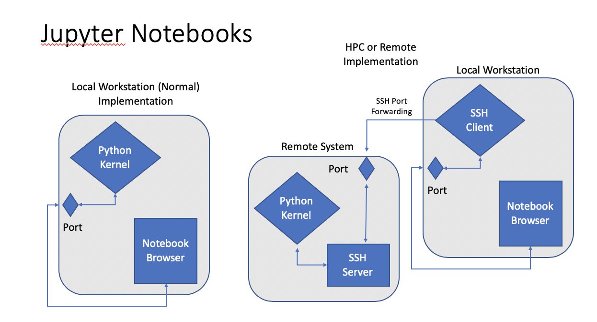

# Jupyter Notebooks
## Overview

Jupyter Notebooks and Jupyter Lab, formerly iPython Notebooks, are quite popular in scientific computing. Notebooks provide an intuitive editor, facilitate check-pointing, smoothly integrate prose with code (better than comments!), and generally facilitate strong collaborations. Perhaps most significantly, Notebooks provide an excellent framework to achieve highly reproducible research.

Originally, iPython notebooks were (almost) strictly Python centric. The rebranding to _Jupyter_ reflects, amongst other things, generalizing the platform to integrate additional languages like _R_ into the fold. _Jupyter Lab_ is a more recent expansion of _Notebook_ that includes a terminal and other tools. 

A _Jupyter Notebook_ or _Lab_ session runs like a web application, with the notebook and programming environment (like Python) running as a service on the host machine. Fundamentally, Jupyter Notebooks are (apparently) designed to run on your local machine, but they can be run on remote systems by using SSH and port forwarding.

---

[//]: # both of these work to render the image:

[//]: # 


*Fig. 1: Diagram of local and HPC Jupyter Notebook connection. In the HPC, or other remote, connection, the local machine uses SSH port-forwarding to connect the local notebook web service port to a port on the remote system.*

---

The details of implementing this on Stanford Earth HPC systems varies slightly, but the same principal concepts apply. This basically requires:
1. Starting a _Jupyter Notebook_ session on the remote system
2. Identifying free ports on the client and remote system. This is typically not challenging, as most operating systems have lots of ports
3. Connecting the local and remote ports via SSH Port Forwarding

CoderWall provides a pretty good general tutorial:  
&nbsp;&nbsp;&nbsp;&nbsp;[https://coderwall.com/p/ohk6cg/remote-access-to-ipython-notebooks-via-ssh](https://coderwall.com/p/ohk6cg/remote-access-to-ipython-notebooks-via-ssh)

**NOTE to Python 2.x Users:** This document will be written in the context of Python 3. Support for Python 2.x is waning, so all Python 2.x scirpts and libraries should be converted to 3.x. See the [discussion below](#python-3x-conversion).

## Sherlock: OnDemand

Jupyter Notebooks can also be accessed via _OnDemand_ Interactive Portal:

- Information: [Sherlock OnDemand](../getting-started/sherlock-access#sherlock-web-interactive-portal)
- Connect to [_Sherlock OnDemand_](https://login.sherlock.stanford.edu/pun/sys/dashboard)

Be sure to follow the UI promts to specify your desired partition and other HPC resources -- just like any other SLURM reqeust, and to load any LMOD modules when the job starts.

## Sherlock: SSH Forwarding
Connections to Jupyter Notebooks can also be made via _ssh_ port forwarding:

1. Connect to a sherlock login node:
	```
	[local]$ ssh <SUNetID>@sherlock.stanford.edu
	```
    Remember, Sherlock will also ask for two-factor authntication.
2. Request an interactive session (note, some of these parameters are optional). Depending on the resources requested, it might take SLURM a few minutes to allocate resources. For example, to request a single task with 4 CPU-cores, with 8 GB/cpu-core (probably the default) on the `serc` partition:
	```
	[sh-lnxx]$ salloc --cpus-per-task=4 --mem-per-cpu=8g --partition=serc
	```
:::{admonition} Notebook jobs can be scripted
:class: tip

The following steps -- loading modules, launching Jupyter, etc., can be scripted, to save time and to set up distinct software configurationbs for specific tasks
:::
{:start="3"}

3. Sherlock will open a compute session; note the prompt will change from `[sh-lnxx]` (a login node) to `[sh-xxx-yy]`. Load modules, set environmental varialbes, and peform shell setup as necerssary. Note, on Sherlock, it may be necessary to load quite a few Python library modules. At the bare minimum, load the `python` and `jupyter` modules, and maybe numpy and pandas for good measure:

	```
	[sh-xxx-yy]$ module load python/3.9
	[sh-xxx-yy]$ module load py-jupyter/1.0.0_py39
	[sh-xxx-yy]$ module load py-numpy/1.20.3_py39 py-numpy py-pandas/1.3.1_py39
	```

	Load aditional modules as necessary. To see a list of available modules, 
	
	```
	[sh-xxx-yy]$ module avail 
	```

	To see a lits of available modules with `python' in the name,
	
	```
	[sh-xxx-yy]$ module avail | grep python
	```
	or, even better, use `module spider`,
	```
	[sh-xxx-yy]$ module spider python
	[sh-xxx-yy]$ module spider py-numpy
	```
4. Start a Jupyter Notebook server. We can specify a port to listen on, or we can note the one it assigns:

	```
	[sh-xxx-yy]$ jupyter-notebook --no-browser --port=xxxxx --ip=`hostname -s`
	```
		
5. Port forwarding: On your local workstation, launch an ssh session with port forwarding:

	```
	[local]$ ssh -L yyyy:<compute_node>:xxxx <SUNetID>@sherlock.stanford.edu
	```
	
	Where `yyyy` is your local port and `xxxx` is the remote port (as requested in the Notebook parameter, `--port=xxxx`). To avoid confusion, these can usually be set to the same value, eg. `-L8892:sh03-09n27:8892`. Again, Sherlock may request two-factor authentication.
6. Launch Jupyter Notebook: On your local machine, cut-paste the token string and navigate to this address:

        http://localhost:xxxxx?token={<the long token string>}
    
:::{admonition} Connect to localhost
:class: tip

NOTE: The full Jupyter URL string might show the compute node name, not `localhost`. Your browser will likely not be able to connect to this address, so be sure the request is addressed to `localhost`. 
:::

## Interactive Figures
Figure rendering in Notebooks can be controlled by using the "magic" expressions `%matplotlib {option}`. For example, `%matplotlib inline` renders `Matplotlib` or `pyplot` figures "inline," as fixed size static images. Several options are available to render interactive figure windows, similar to the familiar `plt.show()` interactive standard in Python CLIs, as well (presumably?). Performance may vary with time, software updates, between one browser and another, etc., so givign the subject a good Googling (or Binging, or query your favorite search engine or ask your preferred VLLM AI tool). One option that recently worked well is,

	%matplotlib notebook

This option appears to work in both SSH forwarded and On Demand sessions, for example:

	%load_ext autoreload
	%autoreload 2
	%matplotlib notebook
	
	import pylab as plt
	import numpy
	
	X=numpy.linspace(0,numpy.pi*2.0, 500)
	Y = numpy.sin(X)
	#
	
	fg = plt.figure(figsize=(10,8))
	ax = fg.add_subplot(1,1,1)
	ax.plot(X,Y, ls='-', lw=3., marker='')
	
	ax.grid()
        
## Port Forwarding: General Comments
Local port forwarding forwards a local port (usually on your local machine) to a remote machine (Sherlock compute node). In other words, traffic to a port on your machine is rerouted to a port on a remote machine. The general syntax is (more or less):  

        [sh-xxx-yy]$ ssh -L <machine_from>:<port_from>:<machine_to>:<port_to> remote_host

This syntax can be awkward, as the use of the term 'local' or 'local_host' is sometimes confusing. For example -- using the more complet notation,  

        [sh-xxx-yy] ssh -L local_host:8888:local_host:8889 me@remote_host
    
forwards port `8888` on the local workstation to port 8889 on `remote_host`, so we awkwardly refer to both the local and remote machines as as `local_host`. This can be better understood as the being the local side on the left and the remote side on the right, so the left `local_host` refers to the local machine running the ssh client, and the right side refers to the remote machine, specified as the argument to the `ssh` command (the ssh host).

This actually arises from some higher versatility in the system, namely that the port need not necessarily map to `remote_host`. As will be discussed below, this can be useful on HPC systems where we port-forward to a worker node via authentication on a login node.

We start with a few comments on the example above. If we assume that your local workstation is named `local_workstation`, and the remote host is `remote_host`, the following are identical ssh port-forwarding statements:

    [sh-xxx-yy]$ ssh -L local_host:8888:local_host:8889 me@remote_host
    [sh-xxx-yy]$ ssh -L local_host:8888:remote_host:8889 me@remote_host
    [sh-xxx-yy]$ ssh -L 8888:local_host:8889 me@remote_host
    [sh-xxx-yy]$ ssh -L local_workstation:8888:local_host:8889 me@remote_host
    [sh-xxx-yy]$ ssh -L local_workstation:8888:remote_host:8889 me@remote_host

The IP address or named URL of either machine may be used as well. 

As discussed above, for some HPC systems -- including Sherlock, worker nodes may not be directly accessible for authention, so we might authenticate to `remote_host` via `login_node`

    [sh-xxx-yy]$ ssh -L 8888:remote_host:8889 me@login_node
    
which wqill map your local port 8888 to port 8889 on `remote_host`, by authenticating with `login_node`. More specifically in the context of Sherlock,

    [sh-xxx-yy]$ ssh -L 8888:compute_node:8889 my_SUNetID@login.sherlock.stanford.edu

forwards your local port `8888` to port `8889` on `compute_node` (actually named something like `sh03-09n22`); this action is authorized by the login node, to which the SSH connection is made.
        

## Python 3.x Conversion

:::{admonition} Support for Python 2.x is ending in January 2020
:class: warning


:::

**NOTICE to Python 2.x Users:** Development and support of Python 2.x has (long since...) ceased and is being systemattically cancelled by contributing organizations. All support of and development on Python 2.7 (the most recent 2.x version) [is slated to end on 1 January 2020](https://pythonclock.org).  `pip` will end support for Pytnon 2.x in 2020. 

Python 2.x scripts and libraries should be converted to Python 3.x. This process is typically a bit involved, but is relatively straight forward. SRCC can help!

- Contact the SDSS-CC support team for assistance
- See the Python [2to3 conversion tool](https://docs.python.org/2/library/2to3.html "Pytnon 2to3"). This is often the begining, not the end of a conversion, but it is a very good start.
- Conversion basically involves:
    - `print` -> `print()`
    - `xrange()` -> `range()`, and generally revisiting `range()` type sequence generators
    - There are a few libraries that have chaned names or organization (`urllib` libraries; `sklearn` submodules might be reogranized, etc.)
    - String handling: Python3 may interprete a string as a binary array, which will need to be "decoded" to be interpreted as a string
    
            stringlike = binary_array.decode()
            arraylike = string.encode()


 
